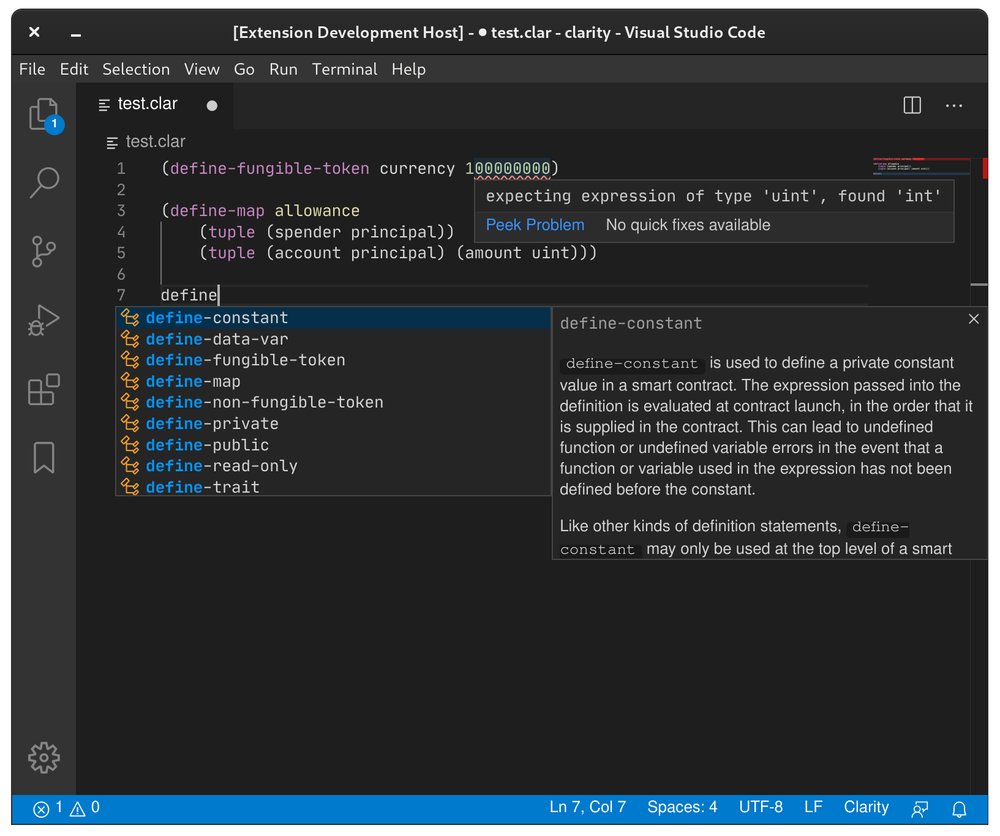

# clarity-lsp

Clarity is a **decidable** smart contract language that optimizes for predictability and security. Smart contracts allow developers to encode essential business logic on a blockchain.

A programming language is decidable if you can know, with certainty, from the code itself what the program will do. Clarity is intentionally Turing incomplete as it avoids `Turing complexity`. This allows for complete static analysis of the entire call graph of a given smart contract. Further, our support for types and type checker can eliminate whole classes of bugs like unintended casts, reentrancy bugs, and reads of uninitialized values.

The Language Server Protocol (LSP) defines the protocol used between an editor or IDE and a language server that provides language features like auto complete, go to definition, find all references etc.

This project aims at leveraging the decidability quality of Clarity and the LSP for providing some great insights about your code, without publishing your smart contracts to a blockchain.



## Quick Start

### VSCode

This is the best supported editor at the moment. clarity-lsp plugin for VS Code is maintained in tree.
You can install the latest release of the plugin from the [marketplace](https://marketplace.visualstudio.com/items?itemName=hirosystems.clarity-lsp).

### Building From Source

Alternatively, both the server and the plugin can be installed from source.


The first step is to ensure that you have Rust and the support software installed.

```bash
curl --proto '=https' --tlsv1.2 -sSf https://sh.rustup.rs | sh
```

From there, you can clone this repository:

```bash
git clone https://github.com/hirosystems/clarity-lsp.git

cd clarity-lsp
```

Then build and install:

```bash
cargo xtask install
```


## Initial feature set
- [x] Auto-complete native functions
- [x] Check contract on save, and display errors inline.
- [x] VS-Code support

## Additional desired features (not exhaustive, not prioritized)
- [x] Inline documentation
- [x] Auto-complete user defined functions
- [ ] Return and display cost analysis
- [x] Resolve contract-call targeting local contracts 
- [ ] Resolve contract-call targeting deployed contracts
- [x] Support for traits
- [ ] Support for multiple errors
- [ ] Supporting more editors (vim, emacs, atom, etc)


## Contributing

### Prerequisites

- rust (>=1.52.0)
- cargo (>=1.52.0)
- node (>=v14.16.0) - Used for git commit hook
- npm (>=7.18.0) - Used for git commit hook

### Guide

This repo follows the [Conventional Commit](https://www.conventionalcommits.org/en/v1.0.0/#summary) spec when writing commit messages.
It's important any pull requests submitted have commit messages which follow this standard.

To start contributing:

1. Fork this repo and clone the fork locally.
1. Create a new branch
   ```bash
   git checkout -b <my-branch>
   ```
1. Run `npm i` in root directory of the local repo to install and initialize `husky` and `commitlint`.

   ```bash
   npm i
   ```

   1. These tools will be used in a git commit hook to lint and validate your commit message. If the message is invalid, `commitlint` will alert you to try again and fix it.

      Bad message:

      ```bash
      $ git commit -m "bad message"
      $ ⧗   input: bad message
      $ ✖   subject may not be empty [subject-empty]
      $ ✖   type may not be empty [type-empty]
      $
      $ ✖   found 2 problems, 0 warnings
      $ ⓘ   Get help: https://github.com/conventional-changelog/commitlint/#what-is-commitlint
      $
      $ husky - commit-msg hook exited with code 1 (error)
      ```

      Good message:

      ```bash
      $ git commit -m "fix: added missing dependency"
      $ [my-branch 4c028af] fix: added missing dependency
      $ 1 file changed, 50 insertions(+)
      ```

1. After making your changes, ensure the following:
   1. `cargo build` runs successfully
   1. `cargo test` runs successfully
   1. You've formatted your code with `cargo fmt --all --`
   1. You've linted the VSCode extension and fixed any violations with `npm run fix`
1. Submit a pull request against the `develop` branch for review.
